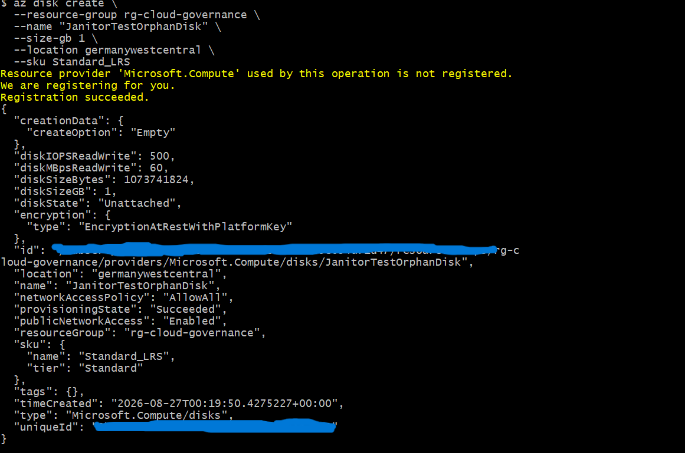
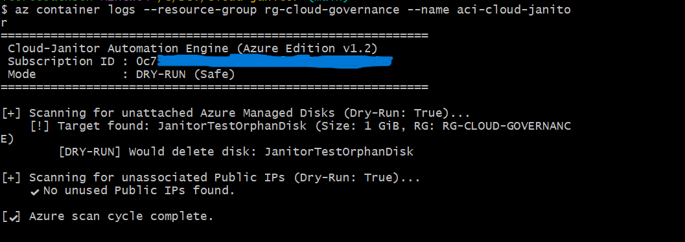

# Cloud-Janitor: Multi-Cloud Governance & FinOps Automation (v1.2)

An automated, serverless cloud governance tool designed to discover, audit, and clean up orphaned infrastructure across **AWS** and **Microsoft Azure**. Engineered with Python Cloud SDKs, packaged in Docker containers, distributed through Docker Hub, and orchestrated via native serverless compute engines (**AWS ECS Fargate** & **Azure Container Instances**).

---

## Business Value & FinOps Impact

Orphaned cloud assets (unattached storage volumes, unassociated static IPs) create unmonitored recurring costs and compliance risks:
* **Cost Optimization:** Eliminates silent cloud sprawl, reducing non-production cloud waste by up to 15–30%.
* **Zero Idle Compute Overhead:** Executes ephemerally in under 20 seconds, costing less than **$0.01/month** to operate per cloud provider.
* **Safe-by-Default Engineering:** Defaults to non-destructive dry-run audits, preventing accidental downtime while generating complete compliance logs.

---

## Multi-Cloud Architecture

```
                          ┌───────────────────────────┐
                          │    Scheduled Trigger      │
                          │ AWS EventBridge / LogicApp│
                          └─────────────┬─────────────┘
                                        │ Scheduled Execution
                                        ▼
                  ┌───────────────────────────────────────────┐
                  │       Serverless Ephemeral Tasks          │
                  │  AWS ECS Fargate  │ Azure Container Inst. │
                  └─────────────────────┬─────────────────────┘
                                        │ Pulls Container Image
                                        ▼
                  ┌───────────────────────────────────────────┐
                  │            Docker Hub Registry            │
                  │  cloud-janitor:latest  │ azure-1.2        │
                  └─────────────────────┬─────────────────────┘
                                        │ Keyless Identity
                                        │ (IAM Task Role / Managed ID)
                                        ▼
                  ┌───────────────────────────────────────────┐
                  │          Cloud Asset Discovery            │
                  │  AWS EC2 / EBS    │ Azure Disks & IPs     │
                  └──────────────┬───────────────────┬────────┘
                                 │                   │
                    Dry-Run Mode │                   │ Enforcement (--force-delete)
                                 ▼                   ▼
                  ┌──────────────────────┐   ┌──────────────────────┐
                  │ CloudWatch / LogHub  │   │ Destructive Purge    │
                  │ (Audit Trail)        │   │ (Resource Cleanup)   │
                  └──────────────────────┘   └──────────────────────┘
```

---

## Platform & Technical Comparison

| Dimension | AWS Implementation | Azure Implementation |
| :--- | :--- | :--- |
| **Compute Runtime** | AWS ECS (Fargate Serverless) | Azure Container Instances (ACI) |
| **Identity & Access** | AWS IAM Task Roles (Keyless) | System-Assigned Managed Identity |
| **RBAC Scope** | Least-Privilege IAM Policy | Subscription Reader / Contributor |
| **Storage Target** | Unattached EBS Volumes (`available`) | Unattached Managed Disks (`Unattached`) |
| **Network Target** | Unassociated Elastic IPs (`None`) | Unassociated Public IP Addresses (`None`) |
| **Logging Service** | Amazon CloudWatch Logs | ACI Native Stream / Log Analytics |
| **Safety Default** | Dry-Run Simulation | Dry-Run Simulation |

---

## Project Structure

```text
cloud-janitor/
├── Dockerfile                  # AWS runtime container specification
├── Dockerfile.azure            # Azure runtime container specification
├── requirements.txt            # AWS dependencies (boto3, botocore)
├── requirements-azure.txt      # Azure dependencies (azure-mgmt-*, azure-identity)
├── janitor.py                  # AWS scanning and governance logic
├── azure_janitor.py            # Azure scanning and governance logic
├── task-definition.json        # AWS ECS task definition
├── eventbridge-target.json     # AWS EventBridge target config
├── ecs-trust-policy.json       # AWS IAM trust policy
├── janitor-policy.json         # AWS IAM permissions policy
├── docs/
│   └── images/                 # Architecture diagrams & terminal proof
└── README.md                   # Multi-Cloud Documentation
```

---

## Technical Capabilities & Skills Demonstrated

* **FinOps Automation:** Implemented policy-driven resource lifecycle governance.
* **Serverless Orchestration:** Deployed on-demand tasks across AWS ECS Fargate and Azure Container Instances.
* **Keyless Identity Security:** Applied AWS IAM Task Roles and Azure System-Assigned Managed Identities to eliminate hardcoded API credentials.
* **Multi-Cloud Software Design:** Built modular Python engines targeting both AWS SDK (`boto3`) and Azure SDK (`azure-mgmt-*`).
* **Container Packaging & CI:** Maintained isolated runtime configurations using Docker and Docker Hub releases.

---

## Step-by-Step Deployment Guide

### Phase 1: Local Container Build & Registry Release

```bash
# 1. Build and push AWS Engine
docker build -t <your-dockerhub-user>/cloud-janitor:latest .
docker push <your-dockerhub-user>/cloud-janitor:latest

# 2. Build and push Azure Engine
docker build -f Dockerfile.azure -t <your-dockerhub-user>/cloud-janitor:azure-1.2 .
docker push <your-dockerhub-user>/cloud-janitor:azure-1.2
```

---

### Phase 2: AWS Deployment (ECS Fargate + EventBridge)

```bash
# 1. Create Log Group & ECS Cluster
aws logs create-log-group --log-group-name /ecs/cloud-janitor --region eu-central-1
aws ecs create-cluster --cluster-name cloud-governance-cluster --region eu-central-1

# 2. Register Task Definition & Run Test Task
aws ecs register-task-definition --cli-input-json file://task-definition.json --region eu-central-1

# 3. Schedule Recurring Daily Audit (Amazon EventBridge)
aws events put-rule --name "DailyCloudJanitorScan" --schedule-expression "cron(0 0 * * ? *)" --region eu-central-1
aws events put-targets --rule "DailyCloudJanitorScan" --targets file://eventbridge-target.json --region eu-central-1
```

---

### Phase 3: Azure Deployment (ACI + System-Assigned Identity)

```bash
# 1. Create Dedicated Resource Group
az group create --name rg-cloud-governance --location germanywestcentral

# 2. Provision Azure Container Instance with Managed Identity
az container create \
  --resource-group rg-cloud-governance \
  --name aci-cloud-janitor \
  --image <your-dockerhub-user>/cloud-janitor:azure-1.2 \
  --os-type Linux \
  --command-line "python azure_janitor.py --dry-run --subscription-id <YOUR_SUBSCRIPTION_ID>" \
  --restart-policy Never \
  --cpu 1 --memory 1 \
  --assign-identity \
  --location germanywestcentral

# 3. Assign Least-Privilege Reader Role across Subscription
PRINCIPAL_ID=$(az container show --resource-group rg-cloud-governance --name aci-cloud-janitor --query identity.principalId -o tsv)
MSYS_NO_PATHCONV=1 az role assignment create --assignee "$PRINCIPAL_ID" --role "Reader" --scope "/subscriptions/<YOUR_SUBSCRIPTION_ID>"
```

---

## Live Verification & Test Outputs

### 1. Azure Target Detection Verification

An unattached test disk (`JanitorTestOrphanDisk`, 1 GiB) was created to test detection accuracy:

<p align="center">
  
</p>

### 2. Autonomous ACI Scan Execution & Dry-Run Log

Invoking the container spins up an ephemeral environment that assumes the Managed Identity, performs discovery, logs targets, and shuts down:

<p align="center">
  
</p>

```text
============================================================
 Cloud-Janitor Automation Engine (Azure Edition v1.2)
 Subscription ID : 0c73f3d3-****-****-****-************
 Mode            : DRY-RUN (Safe)
============================================================

[+] Scanning for unattached Azure Managed Disks (Dry-Run: True)...
    [!] Target found: JanitorTestOrphanDisk (Size: 1 GiB, RG: RG-CLOUD-GOVERNANCE)
        [DRY-RUN] Would delete disk: JanitorTestOrphanDisk

[+] Scanning for unassociated Public IPs (Dry-Run: True)...
    ✔ No unused Public IPs found.

[✔] Azure scan cycle complete.
```